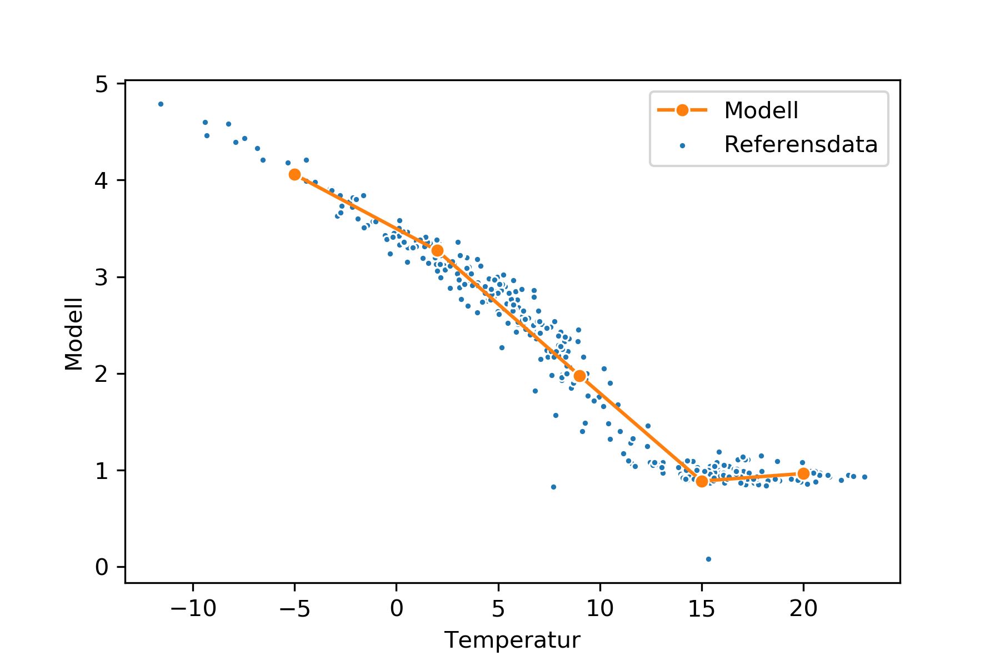
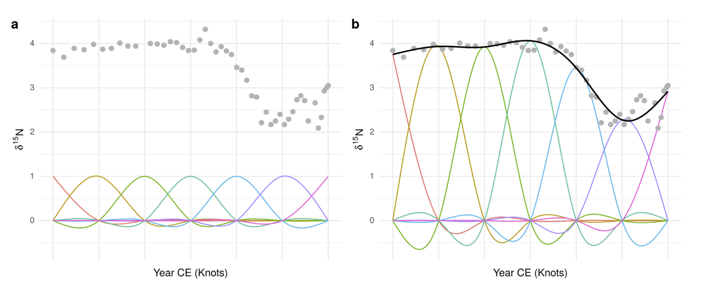

```{r setup, include=FALSE}
knitr::opts_chunk$set(echo = TRUE, warning=FALSE, message=FALSE)
library(knitr)
```

## Using Generalized Additive Models to predict District Heating consumption

The strength of the model that underlies K2 is its simplicity. The K2 algorithm is simply put four separate regression lines with predefined breaks. We can see the fit of the model below:

```{r k2_fit}

```

Any observation that is *too far* from the regression line will generate an alarm. The interpreter, usually an energy analyst at a District Heating company, can easily see what's going on and why the alarms are generated. This technique is called piecewise or segmented regression and used to be a quite popular technique for modelling non linear data, because it is relatively easy to calculate and thus fast. But with a modern computer we are no longer restricted to simple methods, even though performance is a key when dealing with district heating data, which usually involves a lot of data. 

Furthermore, the model in K2 is not perfect. Firstly, we are trying to fit a linear model to non linear data. Secondly, the predefined breaks means we will not get the best fit of the data, because the optimal breaks might vary. 

In this admission I will explore a modelling framework called Generalized Additive Models. It is a popular modelling technique for non linear data, but one of its major upsides is that it still keeps the interpretability that we love in linear models. GAMs are often described as a middle way between simple linear models and black box models such as gradient boosting, random forest and neural networks. Even though interpretability is not a request in this competition I will take this into account anyway.

## What is a Generlized Additive Model?

To explain what a GAM is it is easiest to compare it to a linear model. A linear regression where we model $y$ (district heating consumption) as a result of $x$ (temperature) is defined as line with an intercept $\beta_0$, the coefficient $\beta_1$ which tells us how steep the slope is. Lastly we have the error term, which is all the variation that our coefficients cannot explain.
$$ consumption = \beta_0 + \beta_1*temperature + \epsilon$$
The K2 algorithm can be defined as a linear regression with a separate coefficient for each temperature interval.

$$ consumption = \beta_1*temp_1 + \beta_2*temp_2 + \beta_3*temp_3 + \beta_4*temp_4 + \epsilon$$

A generalized additive model takes a different approach and defines the relationship as a *function* of temperature:

$$consumption = f(x) + \epsilon$$

The function may be a linear regression, but when data is non linear, this is not sufficient. Instead a generalized additive models tries to solve this problem with a smooth spline going through the data. The spline is constructed by many functions and in the case of GAM these are basis functions. The best way is to illustrate this by an example. Below we can see in `a` a number of basis functions with the same coefficients, and to the left `b` where the basis functions have different coefficients so that they fit the data. 

```{r gam_x, fig.cap = "Source: https://github.com/noamross/gam-resources/blob/master/2017-11-14-noamross-gams-nyhackr.pdf"}

```
Now, in theory you could use as many functions as observations, but that would lead to a very wiggly spline. Instead we use a penalty that adjusts the amount of "wigglyness" of the spline. Setting this parameter is crucial, however, we do not need to do this manually, instead we use the `mgcv` package in R to do this for us.

## Exploring the data

Let's start by exploring the data and fitting a GAM to one station. We start by listing the files and write a custom function for importing them.

```{r load_tidyverse, message=FALSE, warning=FALSE}
library(tidyverse)

filer <- tibble(filer = list.files("data")) %>% 
  filter(str_detect(filer, "Station")) %>% 
  .$filer

## Here we create a function
read_sm_file = function(path){
  read_csv(paste0("data/",path)) %>% 
    mutate(station = str_replace(path, ".csv", ""))
}
```

The function `map_df()` takes an input (in this case our files) and applies a function (our customized function) to the input. The function expects the files to be data.frames, and it binds the data.frames together when they all have been read.

```{r read_data, message=FALSE, warning=FALSE}
all_data <- map_df(.x = filer, read_sm_file) %>% 
  janitor::clean_names()
```

We can now view the data:

```{r print_data}
all_data
```

## Exploratory Data Analysis

If we plot the relationship between temperature and consumption we can clearly see that there is a relationship and that it is not linear.

```{r plot_temp}
plot_konsumtion <- ggplot(all_data, aes(temperatur, konsumtion, color = station)) +
  geom_point(size = .5, alpha = .2) +
  facet_wrap(~ station) +
  labs(
    title = "Distric Heating Consumption over time"
  ) +
  theme_minimal() +
  theme(legend.position = "none")

plot_konsumtion
```

Let's start with a randomly chosen station. If we fit a GAM to this data we get one smooth line instead of 4 separate lines we know from K2.

```{r plot_gam}
## The station was randomly chosen
station8 <- filter(all_data, station == "Station_8")

station8 %>% 
  ggplot(aes(x = temperatur, y = konsumtion)) +
  geom_point(color = "lightgreen", alpha = .5) +
  labs(
    title = "Station 8, konsumtion ~ temperatur"
  ) +
  theme_minimal() +
  geom_smooth(method = "gam")
```

We can specify the model into a model object and run a summary on it. We see that with this model we can explain around 90% of the variation. 

```{r first_model}
library(mgcv)

gam_fit <- gam(konsumtion ~ s(temperatur, bs = "cs"),
               data = station8,
               method = "REML",
               family = scat)

summary(gam_fit)
```

We can do some model diagnostics to make sure that the residuals are normally distributed. 

```{r model_diag_1}
library(gratia)
appraise(gam_fit)
```

The residuals seem to be normally distributed but since we are dealing with temporal data we are also interested in how the residuals distribute over time. 
How does the residuals distribute over time?

```{r resid_time}
station8 %>% 
  add_residuals(gam_fit) %>% 
  ggplot(aes(datum, .residual)) +
  geom_point()
```

This is actually a problem. We'd expect the residuals to be equally distributed over time but we can see that they are not. This is usually an indication that the observations are not independent. That is, today's consumption is not independent to yesterday's. That makes sense intuitively but independence is usually an assumption many models have. 

In statistical terms this is called autocorrelation and we can calculate this with the `partial autocorrelation function`(PACF). The plot below illustrates that there is a strong correlation between today's consumption and yesterday's.

```{r pacf}
library(feasts)
library(tsibble)
ts <- station8 %>% 
  select(datum, konsumtion) %>% 
  as_tsibble()

ts %>% 
  PACF() %>% 
  autoplot() +
  scale_x_continuous(breaks = scales::pretty_breaks(20))
```

There are a couple of ways we can model this. Either we can just use the lag of consumption as an explanatory variable in our model or we can try to model this with a mixed model. For this problem we'll just use the lagged variable since it's a bit more straight forward to calculate.

Now, we have a couple of other variables in our dataset that we also would like to include in the model. We are confident that temperature is the main driver here. However, temperature may interact with our other variables, such as wind speed, amount of rain/snow and air pressure. However, dew point temperature has a strong correlation to temperature and is thus excluded. 

```{r corrplot}
library(corrplot)
all_data %>%
  select_if(is.numeric) %>% 
  select(-k2_regression) %>% 
  as.matrix() %>% 
  cor() %>% 
  corrplot()
```

One more thing that might affect our model is the seasonality of the model. 

```{r season}
gg_season(ts)
```

The monthly seasonality may imply that temperature has a different effect depending on what month it is. That is, that a temperature of 15 degrees in September may have a different effect than 15 degrees in March. 

Furthermore, we know that weekly seasonality is a common issue in district heating. Different days in the week may have different consumption patterns. 

```{r weekday}
all_data %>% 
  mutate(weekday = weekdays(datum)) %>% 
  group_by(weekday, station) %>% 
  summarise(median_cons = median(konsumtion)) %>% 
  ggplot(aes(y = weekday, x = median_cons)) +
  geom_col() +
  facet_wrap(~station)
```
These metering stations does not have a strong variation between weekdays so we'll move on with only mothly seasonality, which we can fit by including a seasonal component using `s(x, bs = "cc")`.

```{r gam_all_vars}
station8 <- station8 %>% 
  mutate(month = lubridate::month(datum),
         lag_konsumtion = lag(konsumtion),
         lag_temperatur = lag(temperatur),
         weekday = as.factor(weekdays(datum)))

gam_te <- gam(konsumtion ~ 
                s(temperatur, lag_temperatur) +
                s(nederbordsmangd) +
                s(lufttryck) +
                s(lag_konsumtion) + 
                te(temperatur, vindhastighet) +
                s(month, bs = "cc"),
              data = station8,  method = "REML")

summary(gam_te)
```

This result is interesting since it suggests that extra weather variables does not have a significant effect on consumption, for these metering stations.

Let's have a look at the model diagnostics.

```{r model_diag_all_vars}
appraise(gam_te)
```

If we again have a look at the residuals over time we can see that they are now distributed evenly over time and we have thus redeemded the problem with autocorrelation.

```{r}
station8 %>% 
  filter(!is.na(lag_konsumtion)) %>% 
  add_residuals(gam_te) %>% 
  ggplot(aes(datum, .residual)) +
  geom_point()
```

We can fit the model to our data and see how it behaves:

```{r plot_fit}
station8 <- station8 %>% 
  filter(!is.na(lag_konsumtion)) %>% 
  mutate(gam_fitted = fitted.values(gam_te))

station8 %>% 
  ggplot(aes(x = temperatur, y = konsumtion)) +
  geom_point(color = "lightgreen", alpha = .5) +
  labs(
    title = "Station 8, konsumtion ~ temperatur",
    subtitle = "GAM model fitted "
  ) +
  theme_minimal() +
  geom_line(aes(x = temperatur, y = gam_fitted))
```

However, our goal here is to predict consumption. In order to evaluate our model we split the data in train and validation data for every station, fit the GAM to the training data and evaluate it on the validation data.

We can start by nesting the data by station.

```{r nest_data}
nested_data <- all_data %>% 
  group_by(station) %>% 
  mutate(month = lubridate::month(datum),
         lag_konsumtion = lag(konsumtion),
         lag_temperatur = lag(temperatur),
         weekday_chr = weekdays(datum),
         weekday = lubridate::wday(datum)) %>% 
  nest()

nested_data
```

Now, let's create a random split where we use the large proportion of data to train the model and a smaller amount of the data to test the model. To investigate if our model performs better with the additional variables besides temperature, we also fit a really simple GAM.

```{r tidymodel}
library(tidymodels)
nested_data <- nested_data %>% 
  mutate(split = map(data, initial_split),
         train = map(split, training),
         test = map(split, testing))

nested_data <- nested_data %>% 
  mutate(gam_fit_simple = map(train, ~gam(konsumtion ~ s(temperatur), data = .x, method = "REML")),
           gam_fit = map(train, ~gam(konsumtion ~ te(temperatur, lag_temperatur) + s(lag_konsumtion) + s(month, bs = "cc"), data = .x,  method = "REML")))

pred <- nested_data %>% 
  mutate(pred_simple = map2(gam_fit_simple, test, predict),
         pred_comp = map2(gam_fit, test, predict)) %>% 
  select(station, pred_simple, pred_comp, test) %>% 
  unnest(pred_simple, pred_comp, test)
```

The result shows that the inclusion of lagged variables brings out more performance in the model. 

```{r evaluate}
library(yardstick)
bind_rows(
rmse(ungroup(pred), konsumtion, pred_simple) %>% mutate(model = "pred_simple"),
rmse(ungroup(pred), konsumtion, pred_comp) %>% mutate(model = "pred_complex")
)
```

The last thing we do is to fit the model to all the data and predict consumption for each station on the validation data. However, the validation data is future timestamps and thus do not have consumption, therefore we'll omit the lagged consumption from the model.

```{r final_fit, eval=FALSE}
read_val <- function(path){
  read_csv(path) %>% 
    janitor::clean_names() %>% 
    mutate(month = lubridate::month(datum),
         lag_temperatur = lag(temperatur))
}

read_validation("data/Väder_valideringsperiod.csv") 

result <- nested_data %>% 
  mutate(final_model = map(data, ~gam(konsumtion ~ te(temperatur, lag_temperatur) + s(month, bs = "cc"), data = .x,  method = "REML")),
         validation_data = map("data/Väder_valideringsperiod.csv", read_val),
         pred = map2(.x = final_model, .y = validation_data, predict)) %>% 
  select(station, pred, validation_data) %>% 
  unnest(pred, validation_data)
```

The last thing we do is to write the data to a csv-file and wait for the result...

```{r eval=FALSE}
write_csv(result, "data/result-tavling.csv")
```


